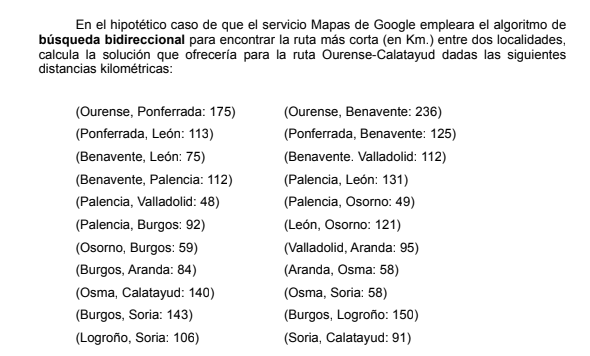
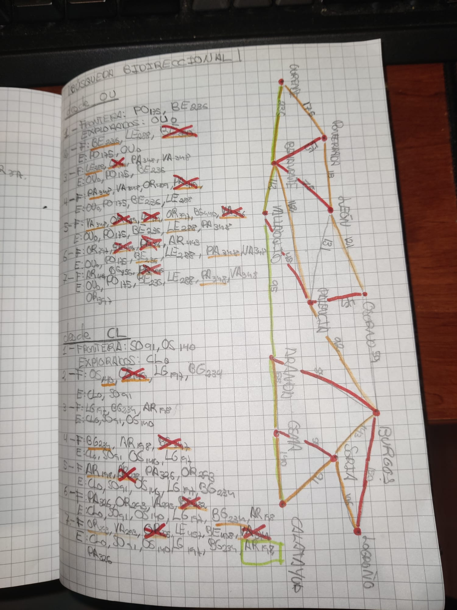
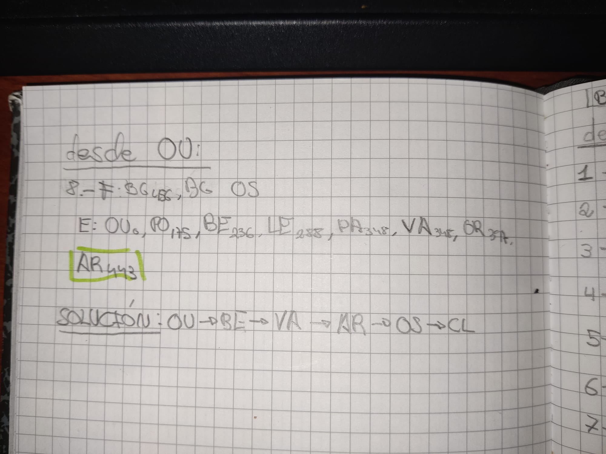

# Ejercicios de algoritmos de busqueda

### Búsqueda bidireccional

|   | Desde Ourense (OU)                                                                                                                                         | Desde Calatayud (CL)                                                                                                                           |
| - | ---------------------------------------------------------------------------------------------------------------------------------------------------------- | ---------------------------------------------------------------------------------------------------------------------------------------------- |
| 1 | **Frontera:** PO.175, BE.236 **Explorados:** OU.0                                                                                        | **Frontera:** SO.91, OS.140  **Explorados:** CL.0                                                                           |
| 2 | **F:** *BE.236*, LE.288, *~~BE.350~~* **E:** OU.0, PO.175                                                                          | **F:** *OS.140*, *~~OS.149~~*, LG.197, BG.234 **E:** CL.0, SO.91                                                                    |
| 3 | **F:** *LE.288*, *~~LE.311~~*, PA.348, VA.348 **E:** OU.0, PO.175, BE.236                                                            | **F:** LG.197, BG.234, AR.198 **E:** CL.0, SO.91, OS.140                                                                                |
| 4 | **F:** PA.348, VA.348, OR.409, *~~PA.415~~* **E:** OU.0, PO.175, BE.236, LE.288                                                       | **F:** *BG.234*, AR.198, *~~BG.347~~* **E:** CL.0, SO.91, OS.140, LG.197                                                            |
| 5 | **F:** *VA.348*, *~~OR.409~~*, *~~LE.419~~*, *OR.397*, BG.440, *~~VA.396~~* **E:** OU.0, PO.175, BE.236, *LE.288*, PA.348 | **F:** *AR.198*, *~~AR.288~~*, PA.326, OR.293 **E:** CL.0, SO.91, OS.140, LG.197, BG.234                                            |
| 6 | **F:** *OR.397*, ~~*BE.440*~~, *~~PA.396~~*, AR.443 **E:** OU.0, PO.175, *BE.236*, LE.288, *PA.348*, VA.348                  | **F:** PA.326, OR.293, VA.293, *~~BG.282~~* **E:** CL.0, SO.91, OS.140, LG.197, *BG.234*, AR.198                                    |
| 7 | **F:** AR.443, BG.456, *~~PA.466~~* **E:** OU.0, PO.175, BE.236, LE.288, *PA.348*, VA.348, OR.397                                    | **F:** *OR.293, VA.293, ~~OR.375~~*, LE.457, BE.348, *~~VA.374~~* **E:** CL.0, SO.91, OS.140, LG.197, BG.234, **AR.198**, PA.326 |
| 8 | **F:** BG.456, BG, OS **E:** OU.0, PO.175, BE.236, LE.288, PA.348, VA.348, OR.397, **AR.443 **                                         |                                                                                                                                                |

**Solución:** OU → BE → VA → AR → OS → CL

